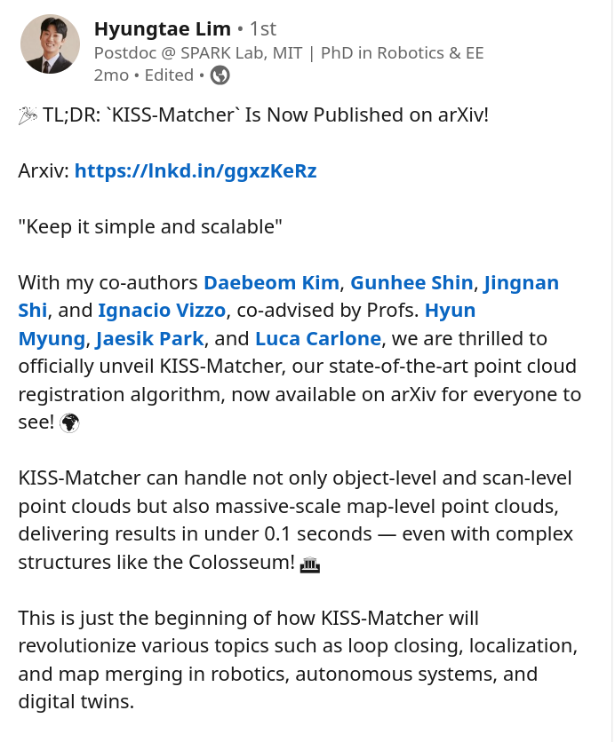
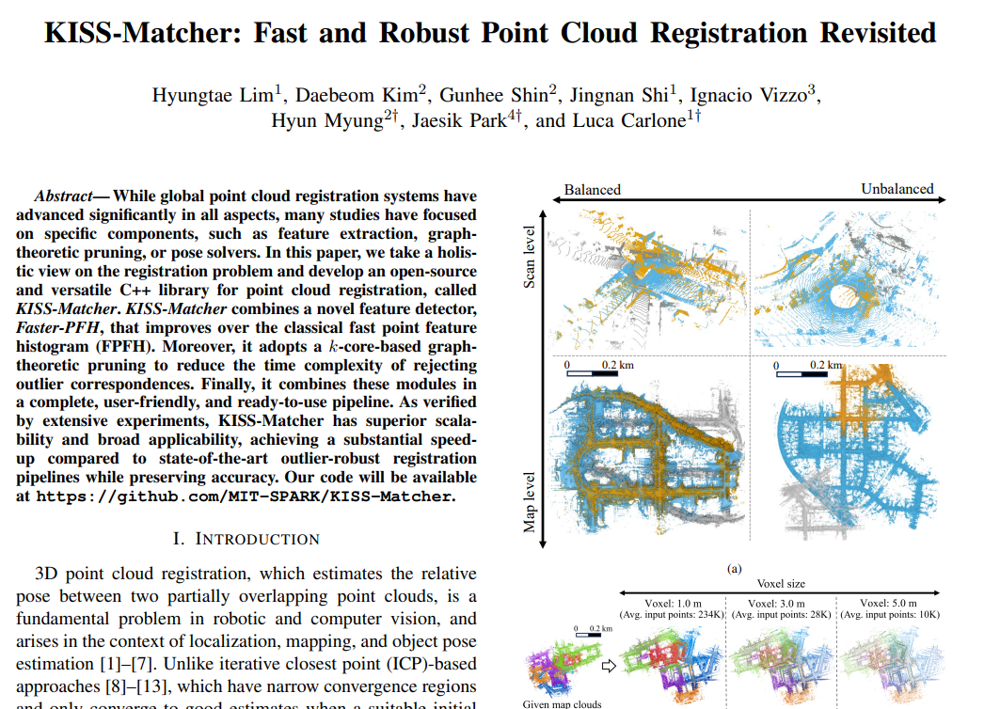
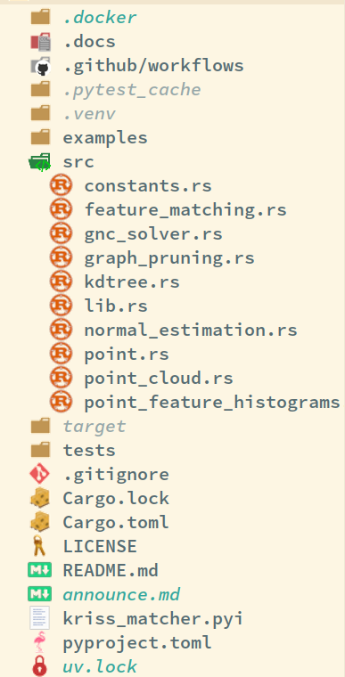
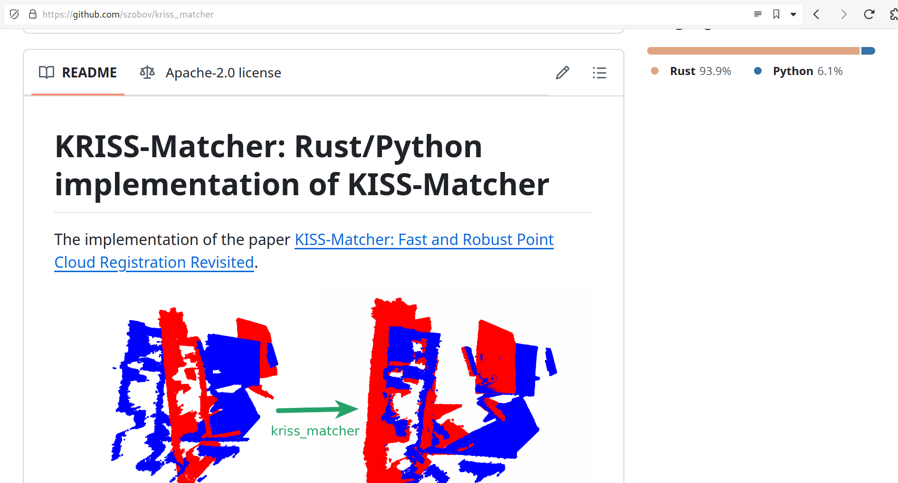
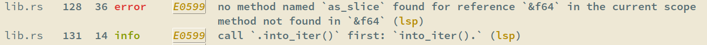
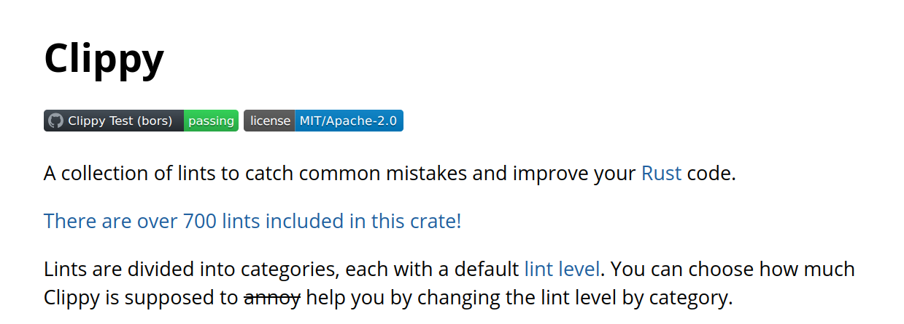
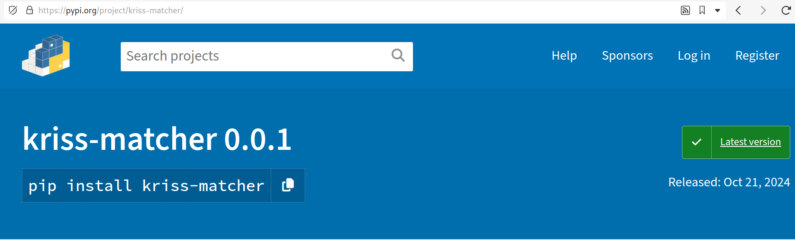
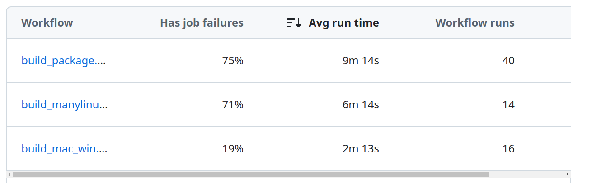

<!-- npx reveal-md --host 0.0.0.0 --port 5252 --theme solarized slides.md -o ouput.html -->
# My way of Rust

in Robotics

---

## Why?

> "PLEASE STOP USING C++"
> 
> -- I told myself

---

## Plan

1. Find compact project to implement in Rust
2. Check that this project is not yet implemented
3. Implement it

---

## Project



---



---

## Existing implementation


---

## Implementation



---


*https://github.com/szobov/kriss_matcher*

---

## Developer Experience

---

## Project structure

```bash
cargo init --vcs git --edition 2021
```

---

## Dependency management

```
cargo add numpy -F nalgebra
```

---

## Lockfile

```toml
# This file is automatically @generated by Cargo.
# It is not intended for manual editing.
version = 3

[[package]]
name = "accelerate-src"
version = "0.3.2"
source = "registry+https://github.com/rust-lang/crates.io-index"
checksum = "415ed64958754dbe991900f3940677e6a7eefb4d7367afd70d642677b0c7d19d"
```

---

## Built-In tests

```bash
cargo test
```


---

## Actionable errors


*endlich kann ich dumm sein!*

---

## Actionable linters


*sehr dumm...*

---
## Libraries

```rust
use petgraph::{Graph, Undirected};
use rustworkx_core::connectivity::core_number;

use kiddo::{KdTree, SquaredEuclidean};

use nalgebra::{DMatrix, Vector3};
use nalgebra_lapack::SVD;
```

---
## Python bindings

```rust
#[pyfunction]
#[pyo3(name = "find_point_cloud_transformation")]
fn find_point_cloud_transformation_py<'py>(
    py: Python<'py>,
    source_points: PyReadonlyArray2<'py, f64>,
    target_points: PyReadonlyArray2<'py, f64>,
    voxel_size: f64,
) -> (Bound<'py, PyArray2<f64>>, Bound<'py, PyArray2<f64>>) {
```

---

## PIP




```bash
maturin build  --compatibility manylinux -r --auditwheel repair

pip install kriss_matcher
```

---

## Showcase


---

## Issues

- Requires learning a new language
- Some libraries are not well documented
- Shared libraries are pain to pre-compile

---

## Shared libraries are pain to pre-compile




---

## Mature projects

- [copper-rs](https://github.com/copper-project/copper-rs): Purpose-built, Rust-native software engine for robotics
- [dora-rs](https://github.com/dora-rs/dora): An extremely fast and simple dataflow oriented robotic framework to manage your projects and run complex apps, written in Rust.

---

## Thanks for listening

- [linkedin/szobovdev](linkedin.com/in/szobovdev/)
- [github/szobov](github.com/szobov)
- [blog.szobov.ru](blog.szobov.ru/)
